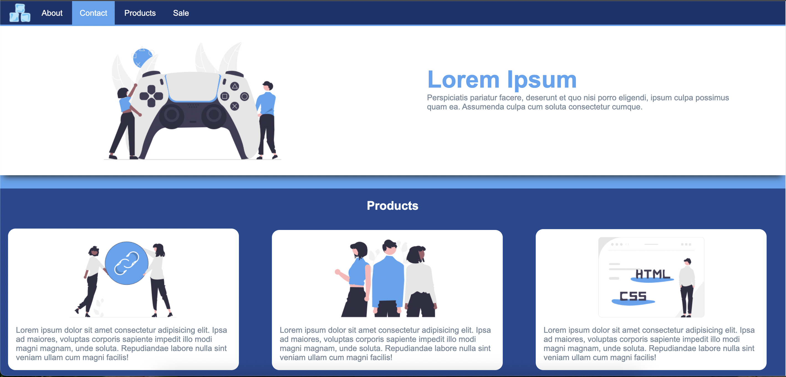
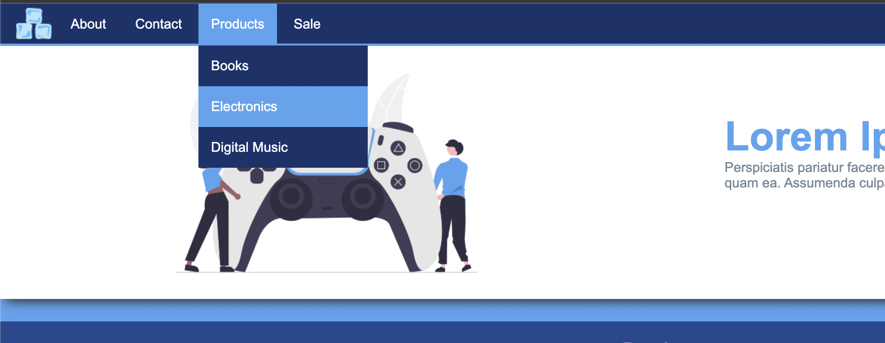

## Instructions

- Create a webpage based on the provided design.
- In the images folder you will find all the assets you need.
- Make sure to add a favicon.
- Use semantic markup.
- Use linear-gradient for the background color of the entire page.
- Menu links have a background of #54a4f1 on hover.
- Hovering on "product" will show up a dropdown menu.
- For the product section stack the boxes next to each other using a display property.
- Do not use positioning for layout purposes.
- Use only the techniques covered so far.

## Layout

## Dropdown

