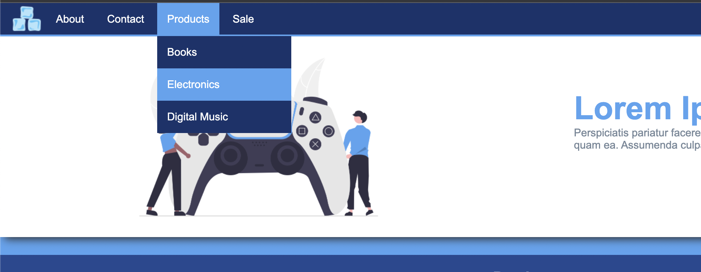

## Anweisungen

- Erstelle eine Webseite auf der Grundlage des vorgegebenen Designs.
- Im Bilderordner findest du alle Assets, die du brauchst.
- Stelle sicher, dass du ein Favicon hinzufügst.
- Verwende semantisches Markup.
- Verwende einen linearen Farbverlauf für die Hintergrundfarbe der gesamten Seite.
- Die Menülinks haben bei Hover einen Hintergrund von #54a4f1.
- Wenn du mit dem Mauszeiger auf "Produkt" gehst, wird ein Dropdown-Menü angezeigt.
- Für den Produktbereich stapelst du die Kästchen mit einer Display-Eigenschaft nebeneinander.
- Verwende die Positionierung nicht für Layoutzwecke.
- Verwende nur die bisher behandelten Techniken.

## Layout

## Dropdown

